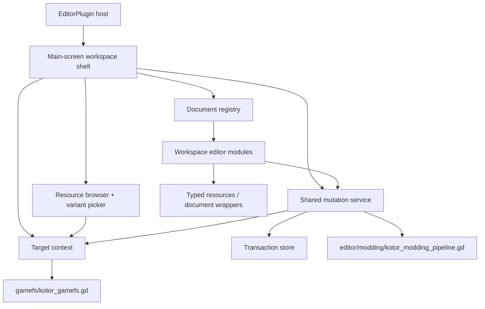
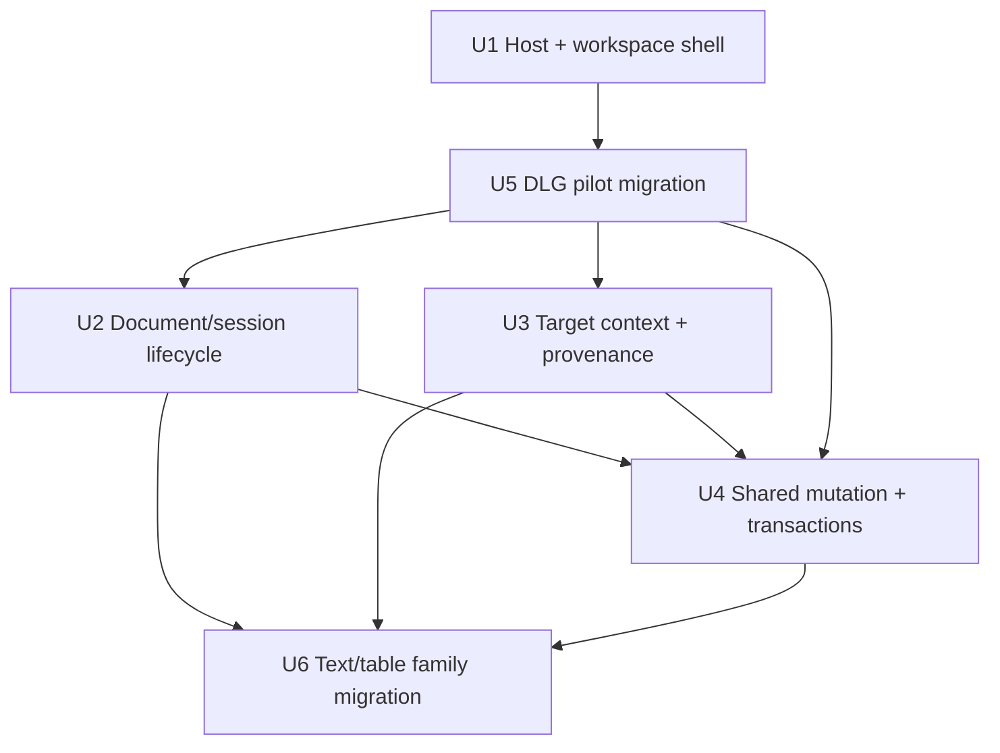
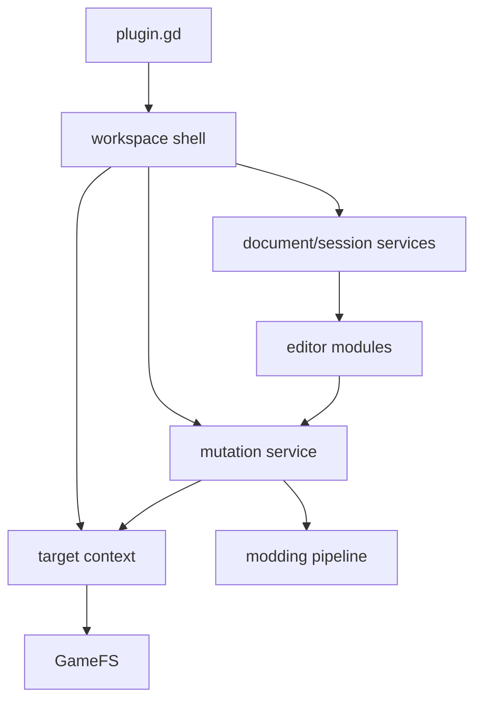

## Progress (2026-05-23)

| Unit | Status |
|------|--------|
| U1 | Landed (`d08e796`) — main-screen host + workspace shell |
| U5 | Landed (`d08e796`, `3f62ff5`) — workspace editor contract + DLG pilot |
| U2 | Landed (`3f62ff5`) — document registry, session, stale-state |
| U3 | Landed (`3f62ff5`) — target context + browsing |
| U4 | Landed (`b5daddb`–`a7564af`) — shared mutation/transaction substrate (see also plan 002) |
| U6 | Landed (`3f62ff5`) — 2DA/TLK/script workspace editors |

Foundation scope for this plan is complete on `feat/main-screen-workspace-foundation`. Entity/module editors and specialist tooling remain follow-up work per plan boundaries.

# feat: Build the Godot-native toolset parity foundation

## Summary

This plan turns `godot-kotor-tools` from a bottom-panel collection of strong vertical slices into a Godot-editor-native workspace platform that can grow toward HolocronToolset-scale breadth without recreating a separate Qt-style application. It does that by promoting a main-screen host, proving the platform with an early DLG migration, then generalizing document/target/mutation services around the existing `GameFS` and modding pipeline seams so text/table editors can follow without continuing to grow `ui/kotor_dock.gd`.

---

## Problem Frame

The repository already proves the core technical bet: pure GDScript parsers, typed resources/documents, install-aware indexing, and format-specific editors are enough to do real KotOR editing inside Godot. The limiting factor is no longer parser coverage; it is product shape. The current plugin still enters as a bottom-panel tool, keeps most orchestration inside one large `ui/kotor_dock.gd`, persists one active game path, and relies on singleton-per-format tab state rather than a document workspace. That shape is good enough for isolated tools, but it will collapse under broad “Godot-native Holocron analogue” scope.

The user direction is broader than the earlier Safe Transaction Layer slice: `godot-kotor-tools` should become the Godot-editor-native counterpart to HolocronToolset, using Godot editor primitives rather than rebuilding a separate Qt shell. That means the plan has to solve workspace architecture, document lifecycle, target provenance, mutation safety, and editor-family expansion together. The safe transaction work remains important, but as one foundational stream inside a larger platform roadmap.

---

## Assumptions

*This plan was authored without synchronous user confirmation. The items below are agent inferences that fill gaps in the input — un-validated bets that should be reviewed before implementation proceeds.*

- Broad toolset parity should promote the product to a Godot main-screen workspace instead of keeping the bottom panel as the primary host.
- The intended UX is a document-style workspace with multiple open resources, not a permanent singleton tab per format.
- Early target switching should be profile-ready in architecture, but phase 1 can still ship with a single active target context instead of a full profile manager.
- The shared mutation contract should cover save, export, install, compare, restore, and remove-override entrypoints rather than only install-to-override.
- Automated verification should land under a new `tests/` tree because the repo currently has no test convention beyond Godot script parsing.

---

## Requirements

### Host and platform shape

- R1. The primary authoring experience must become a Godot-editor-native workspace surface rather than remaining a bottom-panel-only tool.
- R2. The workspace shell must be modular enough that new editor families do not continue landing inside `ui/kotor_dock.gd` as one growing orchestration surface.
- R6. Broad parity must be delivered by shared infrastructure and editor families rather than by imitating HolocronToolset’s standalone-window model inside Godot.
- R9. The architecture must leave room for Godot-native integrations such as docks, inspectors, menus, and undo/redo without making every one of them a phase-1 blocker.

### Document and target lifecycle

- R3. The product must support a document-based workflow with multiple open resources, explicit dirty-state handling, session restore, and stale-document handling.
- R4. Install-aware browsing, variant resolution, and provenance must remain grounded in `gamefs/kotor_gamefs.gd`.
- R13. Target load, reindex, and target-switch behavior must become explicit workspace states instead of hidden synchronous side effects of settings changes.

### Mutation safety and workflow proof

- R5. Save, export, install, compare, restore, and related mutations must converge on one shared preflight/transaction/rollback contract grounded in `editor/modding/kotor_modding_pipeline.gd`.
- R8. The first migrated vertical slice, together with the shared mutation layer landed in the foundation pass, must prove the full lifecycle: browse, open, edit, validate, save/export/install, compare, and restore.
- R11. The safe transaction layer must be treated as a foundational stream inside this roadmap, not as the whole product plan.

### Migration and verification discipline

- R7. Existing working editors must remain usable during migration; the plan cannot require a flag-day rewrite before the workspace becomes useful.
- R10. Verification must expand beyond `godot --headless --quiet --check-only --script` into fixture-based roundtrip, document lifecycle, and mutation workflow coverage.
- R12. High-cost specialist tooling can be phased later without blocking the shared workspace foundation.

---

## Scope Boundaries

- No standalone Qt-like application; the Godot editor remains the host.
- No attempt to reach every HolocronToolset feature in one delivery pass.
- No broad parser/serializer rewrite for formats that already work today.
- No immediate C++ modules or engine-native rewrite; the plan stays within the repository’s Godot 4.6 + GDScript identity.
- No specialist media/model/audio/lip tooling before the workspace, document, and mutation foundations are stable.
- No entity/module-family migration in the foundation pass; that belongs in the next roadmap once the shared platform is proven by DLG plus the text/table family.

### Deferred to Follow-Up Work

- Full profile management and richer target presets: after target context and document switching rules are stable.
- Packaging/share workflows and conflict-board intelligence: after transaction history and provenance surfaces exist.
- Advanced model/texture/audio authoring tools: after the shared editor contract supports the main data families.
- Generic GFF/entity and area/module editor migration: after the foundation plan proves the shared platform with DLG plus text/table editors.

---

## Context & Research

### Relevant Code and Patterns

- `plugin.gd`: current `EditorPlugin` entry point and bottom-panel host.
- `editor/shell/kotor_editor_shell.gd`: thin shell wrapper around the current dock.
- `ui/kotor_dock.gd`: current monolithic workspace surface, editor routing, and action wiring.
- `editor/core/kotor_editor_state.gd`: persisted game-path state and GameFS bootstrap.
- `gamefs/kotor_gamefs.gd`: canonical install index, variant resolution, and precedence rules.
- `editor/modding/kotor_modding_pipeline.gd`: current export/install/compare/write seam and existing overwrite-backup behavior.
- `resources/documents/kotor_dlg_document.gd` and sibling document wrappers: typed, validation-aware document logic worth extending rather than bypassing.

### Institutional Learnings

- `docs/ideation/2026-05-23-open-ideation.md` ranked safe transactions, compare-first workflows, document contracts, and profiles as the strongest repo-grounded directions.
- `docs/brainstorms/2026-05-23-safe-transaction-layer-requirements.md` already defines concrete install-safety requirements that should plug into the shared mutation substrate in this plan.
- No `docs/solutions/` artifacts exist yet, so current repo code and the two new planning docs are the strongest local guidance.

### External References

- OpenKotOR/HolocronToolset: capability reference for broad toolset parity.
- Godot 4.6 `EditorPlugin`, `EditorDock`, `EditorUndoRedoManager`, `EditorFileSystem`, and inspector-plugin docs: host and lifecycle constraints for a large editor plugin.
- Dialogic: example of a large modular Godot editor plugin organized around modules and managers instead of one mega-tool script.
- Mod Organizer 2 and r2modman: strong adjacent patterns for target awareness, safety, provenance, and phased tooling breadth.

---

## Key Technical Decisions

- **Move to a main-screen-first workspace:** Godot 4.6 supports workspace-scale editor extensions more naturally as a main screen with auxiliary docks and inspectors than as a single bottom panel. The plan treats the bottom panel as a migration aid, not the final host.
- **Keep `GameFS` and the modding pipeline canonical:** install indexing, resource precedence, and write/install/export mechanics already have the right seams. New workspace services should orchestrate around them rather than bypass them.
- **Adopt a document workspace before broad editor expansion:** parity will fail if more features keep landing in singleton format tabs. A document registry, dirty/stale guards, and session restore are foundational, not polish.
- **Pilot the platform with DLG before over-generalizing services:** dialogue editing already exercises validation, linked navigation, and install-aware writes, which makes it the best proving ground for the platform shape. The thin DLG migration should land immediately after the host change so later shared services are shaped by a real consumer.
- **Make transaction safety a shared substrate owned by a new mutation service:** the existing modding pipeline should remain the serializer/writer seam, while a separate mutation service owns preflight, transaction records, restore behavior, and entrypoint coordination.
- **Expand by editor family, not by raw feature count:** this foundation plan carries the pilot and the text/table family; later plans can move entity/module editors onto the same contract once the platform is proven.
- **Keep logic headless where possible:** typed documents, target resolution, and mutation logic should stay callable without UI ownership so they can be tested and reused across multiple workspace surfaces.
- **Treat indexing as explicit workspace state:** reindex and target-switch flows should run through visible coarse loading/ready/error boundaries rather than remaining hidden synchronous side effects of editor settings mutation.

---

## Open Questions

### Resolved During Planning

- **Which host shape best fits this roadmap?** A main-screen workspace with auxiliary docks/inspectors is the best match for Godot 4.6 and for the repo’s desired product breadth.
- **Which existing seams remain authoritative?** `gamefs/kotor_gamefs.gd` stays authoritative for install-aware browsing and provenance; `editor/modding/kotor_modding_pipeline.gd` stays authoritative for mutations.
- **What should prove the platform first?** The DLG editor is the first pilot because it already combines editing, validation, linked navigation, and write-back behavior.
- **How should early progress be measured?** By shared workflow coverage and safety across editor families, not by how many tabs or formats are superficially exposed.
- **Where should transaction state live?** In a new mutation service layered over the existing modding pipeline, not inside the pipeline itself.
- **How should indexing be introduced into the workspace?** As an explicit coarse loading/ready/error state owned by the workspace instead of an invisible side effect of editor settings changes; detailed progress reporting can wait until `GameFS` exposes stronger hooks.

### Deferred to Implementation

- **Session persistence details:** the exact storage format and retention model for open documents, stale markers, and transaction metadata should be finalized after the workspace services exist.
- **Undo/redo rollout depth:** Godot-native undo/redo should be part of the roadmap, but the precise phase-1 boundary for external-resource history integration should be decided against real implementation constraints.
- **Migration granularity per editor:** some simple editors may be adapted faster than full rewrites; the exact cut line should follow characterization of each editor surface during execution.
- **Profile system timing:** once target context exists, decide whether full named profiles belong in the first major parity milestone or the next one.

---

## Output Structure

```text
editor/
  workspace/
    kotor_main_screen.gd
    kotor_workspace_controller.gd
    kotor_document_registry.gd
    kotor_workspace_session.gd
    kotor_target_context.gd
    kotor_stale_state_registry.gd
  navigation/
    kotor_resource_locator.gd
  transactions/
    kotor_mutation_service.gd
    kotor_transaction_store.gd
ui/
  workspace/
    kotor_workspace_shell.gd
    panels/
      resource_browser_panel.gd
      validation_panel.gd
    editors/
      kotor_workspace_editor.gd
      dlg_workspace_editor.gd
      twoda_workspace_editor.gd
      tlk_workspace_editor.gd
      script_workspace_editor.gd
resources/
  documents/
    kotor_twoda_document.gd
    kotor_tlk_document.gd
    kotor_script_document.gd
tests/
  editor/
    test_plugin_workspace_host.gd
    test_dlg_workspace_editor.gd
    test_workspace_documents.gd
    test_target_context.gd
    test_mutation_service.gd
    test_transaction_restore.gd
    test_text_table_editors.gd
```

---

## High-Level Technical Design

> *This illustrates the intended approach and is directional guidance for review, not implementation specification. The implementing agent should treat it as context, not code to reproduce.*



---

## Alternative Approaches Considered

- **Keep the bottom panel and only split the existing dock into smaller tabs:** rejected because the host surface would still fight Godot’s intended workspace model and would keep the product visually and structurally constrained.
- **Rebuild the toolset as a standalone app inside this repo:** rejected because the user explicitly wants Godot-editor-native behavior rather than another custom shell.
- **Add more editors before refactoring the platform:** rejected because it would deepen the current monolith and make every later migration harder.

---

## Implementation Units



### U1. Promote the plugin to a main-screen workspace host

**Goal:** Replace the bottom-panel-only entry shape with a main-screen workspace shell so the product has a scalable host before deeper panel extraction begins.

**Requirements:** R1, R2, R7, R9

**Dependencies:** None

**Files:**
- Create: `editor/workspace/kotor_main_screen.gd`
- Create: `editor/workspace/kotor_workspace_controller.gd`
- Create: `ui/workspace/kotor_workspace_shell.gd`
- Modify: `plugin.gd`
- Modify: `editor/shell/kotor_editor_shell.gd`
- Test: `tests/editor/test_plugin_workspace_host.gd`

**Approach:**
- Introduce a main-screen workspace host that owns the new shell and treats the existing dock as a migration surface rather than the root UI.
- Preserve importer/saver registration and plugin lifecycle semantics from `plugin.gd` while moving user-facing orchestration into the new shell.
- Keep the host switch intentionally narrow: prove main-screen lifecycle and workspace entry first, then split panel responsibilities only when the first migrated editor needs them.

**Execution note:** Start with characterization coverage around plugin enable/disable and shell cleanup so the host migration does not regress editor lifecycle behavior.

**Patterns to follow:**
- `plugin.gd`
- `editor/shell/kotor_editor_shell.gd`

**Test scenarios:**
- Happy path — enabling the plugin registers the existing registries and opens the KotOR workspace as a main-screen surface.
- Happy path — switching away from and back to the workspace restores the shell without duplicating panels or leaking controls.
- Edge case — starting with no valid game path still renders a safe empty-state workspace rather than a broken panel tree.
- Error path — disabling and re-enabling the plugin tears down and recreates the workspace cleanly.
- Integration — legacy actions reachable through the old shell still route into the new workspace surfaces during migration.

**Verification:**
- The primary entrypoint is no longer bottom-panel-only.
- Host lifecycle remains safe across enable, disable, and re-enable flows.

---

### U5. Define the workspace editor contract and land the thin DLG pilot

**Goal:** Establish the shared editor-module contract with the smallest real consumer: move DLG onto the new workspace early enough that later services are shaped by a real editor instead of by abstract design.

**Requirements:** R2, R7, R8, R9, R10

**Dependencies:** U1

**Files:**
- Create: `ui/workspace/editors/kotor_workspace_editor.gd`
- Create: `ui/workspace/editors/dlg_workspace_editor.gd`
- Create: `ui/workspace/panels/validation_panel.gd`
- Modify: `resources/documents/kotor_dlg_document.gd`
- Modify: `ui/workspace/kotor_workspace_shell.gd`
- Modify: `ui/kotor_dock.gd`
- Test: `tests/editor/test_dlg_workspace_editor.gd`

**Approach:**
- Define the minimum shared editor contract: open document, render editor chrome, report dirty state, surface validation, and call the existing pipeline through a thin adapter where needed.
- Migrate DLG immediately after the host change so the later generalized document, target, and mutation services can be shaped by real navigation and validation needs.
- Keep the pilot narrow: preserve intra-dialogue editing and reference visibility now, and leave cross-resource navigation to the shared target/navigation layer in U3.
- Keep `KotorDLGDocument` as the source of truth for typed behavior and use the thin DLG pilot to identify what belongs in shared services versus what remains editor-specific.

**Patterns to follow:**
- `resources/documents/kotor_dlg_document.gd`
- Current DLG editing and validation flow in `ui/kotor_dock.gd`

**Test scenarios:**
- Happy path — opening a DLG document renders node editing, summary, validation, and save/install actions through the workspace editor contract.
- Happy path — editing dialogue text and links updates dirty state and validation output in real time.
- Edge case — intra-dialogue node/link navigation remains correct in the thin pilot even before shared cross-resource navigation lands.
- Edge case — the DLG pilot still works when no valid game path is configured and validation must degrade gracefully.
- Error path — validation failures block or warn on mutation according to the current thin adapter rules.
- Integration — the DLG pilot proves the new host can support a real editor without depending on the legacy dock as the root shell.

**Verification:**
- One real editor works in the new host before the platform is over-generalized.
- The DLG pilot exposes the seams that later shared services need to own.

---

### U2. Add workspace document, session, and stale-state services

**Goal:** Introduce a document registry that supports multiple open resources, dirty-state ownership, session restore, and stale-document tracking independent of any one editor surface.

**Requirements:** R2, R3, R7, R8, R10

**Dependencies:** U1, U5

**Files:**
- Create: `editor/workspace/kotor_document_registry.gd`
- Create: `editor/workspace/kotor_workspace_session.gd`
- Create: `editor/workspace/kotor_stale_state_registry.gd`
- Modify: `editor/core/kotor_editor_state.gd`
- Modify: `ui/workspace/kotor_workspace_shell.gd`
- Test: `tests/editor/test_workspace_documents.gd`

**Approach:**
- Move dirty-state ownership out of individual tabs and into a shared registry keyed by resource identity and source variant.
- Persist enough session state to restore open documents, active selections, and panel layout without hard-coding behavior into each editor.
- Generalize the document/session rules from what the thin DLG pilot actually needs, then define stale-state transitions for reindex, target switch, external change detection, and plugin restart so later editors can reuse the same lifecycle rules.

**Patterns to follow:**
- `editor/core/kotor_editor_state.gd`
- Dirty flags and editor state currently embedded in `ui/kotor_dock.gd`
- Change-tracking behavior in typed document wrappers

**Test scenarios:**
- Happy path — opening multiple resources creates separate documents whose dirty state is tracked independently.
- Happy path — restarting the plugin restores the prior open-document set and active workspace selection.
- Edge case — switching away from a dirty document offers save/export/install/discard/cancel behavior rather than silently dropping changes.
- Edge case — reindexing the active target marks affected documents stale without immediately destroying their draft state.
- Error path — reopening a session whose underlying file no longer exists surfaces a recoverable missing-source state.
- Integration — document lifecycle state can be consumed by multiple workspace panels without editor-specific duplication.

**Verification:**
- No single editor owns global dirty/session logic.
- Document lifecycle rules are shared and reusable across later editor migrations.

---

### U3. Unify target context, browsing, and variant provenance

**Goal:** Make install selection, variant provenance, and resource opening explicit shared services so the workspace can browse winning resources and explicit variants without ambiguity.

**Requirements:** R3, R4, R6, R8, R9, R13

**Dependencies:** U1, U5

**Files:**
- Create: `editor/workspace/kotor_target_context.gd`
- Create: `editor/navigation/kotor_resource_locator.gd`
- Modify: `editor/core/kotor_editor_state.gd`
- Modify: `gamefs/kotor_gamefs.gd`
- Create: `ui/workspace/panels/resource_browser_panel.gd`
- Modify: `ui/workspace/kotor_workspace_shell.gd`
- Test: `tests/editor/test_target_context.gd`

**Approach:**
- Wrap the current single `game_path` persistence in a richer target context that can describe target status, provenance, and future profile expansion without requiring profiles on day one.
- Keep this layer thin: `gamefs/kotor_gamefs.gd` remains authoritative for index and precedence logic, while the new service owns workspace-specific concerns such as visible target state, explicit variant opening, and guarded target switching.
- Make indexing and reindex visible workspace states with coarse loading/ready/error handling instead of hidden synchronous side effects of editor settings mutation.

**Patterns to follow:**
- `editor/core/kotor_editor_state.gd`
- `gamefs/kotor_gamefs.gd`
- Install-aware browsing behavior currently routed through `ui/kotor_dock.gd`

**Test scenarios:**
- Happy path — opening a resource from search opens the winning variant with explicit provenance metadata.
- Happy path — selecting a specific core or override variant opens that exact source instead of silently redirecting to the winner.
- Edge case — switching targets with clean documents shows explicit indexing state, reindexes successfully, and refreshes the browser state.
- Edge case — switching targets with dirty documents blocks until the lifecycle choice is resolved.
- Error path — partial or broken installs produce clear status and do not crash the browser workflow.
- Integration — target context updates propagate to the browser, open documents, and workspace state consistently so U4 can layer the shared mutation service on top without inventing a second target model.

**Verification:**
- Variant/source targeting is explicit and shared.
- Wrong-target or wrong-variant edits become harder by design.

---

### U4. Create a shared mutation and transaction substrate

**Goal:** Turn save/export/install/compare/restore/remove-override behavior into one shared mutation contract with preflight, transaction recording, rollback, and workspace-visible outcomes.

**Requirements:** R4, R5, R8, R10, R11

**Dependencies:** U2, U3, U5

**Files:**
- Create: `editor/transactions/kotor_mutation_service.gd`
- Create: `editor/transactions/kotor_transaction_store.gd`
- Modify: `editor/modding/kotor_modding_pipeline.gd`
- Modify: `ui/workspace/kotor_workspace_shell.gd`
- Modify: `ui/kotor_dock.gd`
- Test: `tests/editor/test_mutation_service.gd`
- Test: `tests/editor/test_transaction_restore.gd`

**Approach:**
- Keep `editor/modding/kotor_modding_pipeline.gd` focused on serialization/write mechanics and add a separate mutation service that can preflight actions, classify touched files, record results, and expose rollback availability.
- Reuse the Safe Transaction Layer requirements as the install-safety baseline, but widen the contract so all mutation entrypoints speak the same result model.
- Prove the shared contract first through existing activity/report surfaces in the workspace and legacy dock adapters; dedicated history chrome can follow once the service semantics are stable.

**Execution note:** Add characterization coverage around current export/install behavior before widening the contract so legacy behavior changes are intentional.

**Patterns to follow:**
- `editor/modding/kotor_modding_pipeline.gd`
- `docs/brainstorms/2026-05-23-safe-transaction-layer-requirements.md`

**Test scenarios:**
- Covers the install preflight acceptance cases — installing a new override file reports a create, allows cancel, and leaves the target unchanged when canceled.
- Covers the overwrite-and-rollback acceptance cases — overwriting an existing override captures prior contents, records a transaction, and exposes rollback.
- Covers the rollback-blocking acceptance case — destructive actions that cannot capture rollback data are blocked and reported clearly.
- Happy path — export, install, and remove-override entrypoints all produce the same transaction/result envelope.
- Edge case — unchanged writes short-circuit to a no-op result without producing misleading transaction noise.
- Error path — restore against a target that changed again after the original transaction is recorded as a conflict or degraded restore result rather than a silent overwrite.
- Integration — successful mutations refresh target-aware workspace state and compare visibility without editor-specific refresh code.

**Verification:**
- All mutation entrypoints route through one shared contract.
- Transaction history and rollback become workspace features instead of implementation details.

---

### U6. Migrate text and table editors onto the shared workspace contract

**Goal:** Move 2DA, TLK, and script editing off singleton tabs and onto reusable workspace/editor services so the next editor families compound instead of duplicating shell logic.

**Requirements:** R2, R3, R5, R6, R7, R10

**Dependencies:** U2, U3, U4, U5

**Files:**
- Create: `resources/documents/kotor_twoda_document.gd`
- Create: `resources/documents/kotor_tlk_document.gd`
- Create: `resources/documents/kotor_script_document.gd`
- Create: `ui/workspace/editors/twoda_workspace_editor.gd`
- Create: `ui/workspace/editors/tlk_workspace_editor.gd`
- Create: `ui/workspace/editors/script_workspace_editor.gd`
- Modify: `ui/workspace/kotor_workspace_shell.gd`
- Modify: `ui/kotor_dock.gd`
- Test: `tests/editor/test_text_table_editors.gd`

**Approach:**
- Introduce document wrappers where they are missing so 2DA, TLK, and script workflows can share dirty-state, stale-state, validation, and mutation semantics with DLG.
- Reuse the workspace editor contract for search-heavy and text-heavy tools rather than creating a second family of bespoke shell rules.
- Standardize counterpart lookup, compare visibility, and mutation actions across the family so they feel like one workspace, not three unrelated tools.

**Patterns to follow:**
- The editor contract established in U5
- Current 2DA, TLK, and script flows in `ui/kotor_dock.gd`
- Existing resource wrappers in `resources/`

**Test scenarios:**
- Happy path — 2DA edits roundtrip through the workspace contract and mutation service without losing table structure.
- Happy path — TLK search/edit/save/install flows use the shared document lifecycle and shared transaction/report surfaces.
- Happy path — script documents expose source/binary counterpart lookup through the shared navigation services.
- Edge case — multiple open text/table documents maintain independent dirty and stale state.
- Error path — invalid script/source states report clear validation failures and do not produce silent writes.
- Integration — compare and restore flows are consistent across DLG, 2DA, TLK, and script editors.

**Verification:**
- Text/table tools no longer depend on bespoke singleton tabs.
- Reuse is strong enough that adding more low- to medium-complexity editors gets cheaper.

---

## System-Wide Impact



- **Interaction graph:** plugin lifecycle now fans into shared workspace services instead of a single dock script; editor modules consume document, target, and mutation services rather than owning them.
- **Error propagation:** target-index, validation, and write failures should surface through shared workspace result/reporting surfaces instead of format-specific silent fallbacks.
- **State lifecycle risks:** dirty documents, stale documents after reindex, and transaction history persistence become shared concerns that must be solved once and reused everywhere.
- **API surface parity:** importer/saver registration, parser/resource contracts, and `GameFS` precedence rules should remain intact while the UI host changes around them.
- **Integration coverage:** plugin enable/disable, open-doc restore, target switching, compare/restore, and cross-editor navigation all require cross-layer coverage beyond unit-only testing.
- **Unchanged invariants:** the repo remains Godot 4.6 + GDScript, `GameFS` remains the install-aware resolver, and the modding pipeline remains the canonical write/export/install seam.

---

## Success Metrics

- The primary workspace no longer depends on bottom-panel-only hosting.
- `ui/kotor_dock.gd` is no longer growing as the default place for new cross-editor orchestration and begins shrinking as responsibilities move into dedicated modules.
- At least one rich editor (DLG) and one simpler editor family (2DA/TLK/script) use the shared document and mutation platform end-to-end.
- All mutation entrypoints expose preflight/result/rollback semantics through one shared substrate.
- The repo gains fixture-based workflow coverage that proves document lifecycle and mutation safety beyond parser-level script checks.

---

## Dependencies / Prerequisites

- Implementation should keep a current capability inventory against HolocronToolset so parity claims stay grounded during execution.
- The Godot 4.6 editor-plugin host APIs selected during implementation should prefer non-deprecated main-screen/dock surfaces over legacy bottom-panel-only patterns.
- Existing parser and serializer behavior should be characterized before the workspace migration starts so later regressions are attributable.

---

## Risk Analysis & Mitigation

| Risk | Likelihood | Impact | Mitigation |
|------|-----------|--------|------------|
| Main-screen host migration regresses plugin lifecycle or discoverability | Medium | High | Characterize enable/disable behavior first and keep the old shell available as a temporary compatibility surface during migration |
| Document/session model introduces new data-loss paths | Medium | High | Centralize dirty/stale state early, add workflow coverage before migrating many editors, and make save/discard/cancel rules shared |
| Mutation contract diverges across editors during rollout | Medium | High | Route all mutations through one service anchored on the existing modding pipeline and block new bespoke write paths |
| Migration stalls after one pilot editor, leaving two competing shells indefinitely | Medium | Medium | Sequence family migrations immediately after the pilot and require each later unit to remove orchestration duties from `ui/kotor_dock.gd` instead of adding new ones |
| Broad parity scope turns into endless feature sprawl | High | Medium | Expand by editor family and workflow coverage, keep specialist tools deferred until the shared platform is stable |

---

## Phased Delivery

### Phase 1

- U1, then U5: establish the new host and immediately prove it with the thin DLG pilot.

### Phase 2

- U2 through U4: generalize document/session rules, target/index state, and the shared mutation substrate based on the pilot.

### Phase 3

- U6: move the text/table family onto the shared contract, then spin the next plan for entity/module migration and specialist tools.

---

## Documentation Plan

- Update `README.md` so the product description, host shape, and workflow claims reflect the new workspace model once the migration lands.
- Update `.github/copilot-instructions.md` as the shell/module boundaries and validation strategy change.
- Add a capability/parity reference doc once execution begins so future plan/work passes stay grounded against the HolocronToolset target.

---

## Documentation / Operational Notes

- The workspace migration should ship in a compatibility-first way: avoid breaking already-working format editors before their replacements are ready.
- If session restore or transaction metadata stores user-local state, keep the persistence location visible and support manual cleanup or reset.
- Any rollout that changes where users enter the tool should include brief in-editor orientation so existing users do not think the plugin disappeared.

---

## Sources & References

- Supporting planning doc: `docs/brainstorms/2026-05-23-safe-transaction-layer-requirements.md`
- Supporting planning doc: `docs/ideation/2026-05-23-open-ideation.md`
- Related code: `plugin.gd`
- Related code: `editor/shell/kotor_editor_shell.gd`
- Related code: `editor/core/kotor_editor_state.gd`
- Related code: `gamefs/kotor_gamefs.gd`
- Related code: `editor/modding/kotor_modding_pipeline.gd`
- Related code: `ui/kotor_dock.gd`
- Related code: `resources/documents/kotor_dlg_document.gd`
- External reference: https://github.com/OpenKotOR/HolocronToolset
- External reference: https://docs.godotengine.org/en/4.6/classes/class_editorplugin.html
- External reference: https://docs.godotengine.org/en/4.6/classes/class_editordock.html
- External reference: https://docs.godotengine.org/en/4.6/classes/class_editorundoredomanager.html
