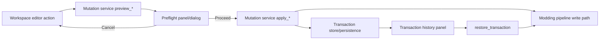

## Progress (2026-05-23)

| Unit | Status |
|------|--------|
| U1 | Landed (`b5daddb`) |
| U2 | Landed (`d503b7c`) — preflight dialogs in workspace editors |
| U3 | Landed (`d503b7c`) — transaction history panel |
| U4 | Landed (`45fdb8c`) — legacy dock install/export → shared mutation contract |
| U5 | Landed (`a7564af`) — acceptance matrix tests + backup-capture guard |

All implementation units for this plan are landed on `feat/main-screen-workspace-foundation`. Follow-up work (dock preflight UI, rich diff preflight) is out of v1 scope per plan boundaries.

# feat: Implement the safe transaction layer workspace workflow

## Summary

This plan delivers the safe transaction layer defined in `docs/brainstorms/2026-05-23-safe-transaction-layer-requirements.md` by finishing the end-to-end user workflow inside the workspace: preflight preview and cancel, explicit transaction recording, visible history, and in-product restore. It extends the existing install-aware and mutation seams instead of introducing a separate installer model.

---

## Problem Frame

The repository already has strong transaction primitives in `editor/transactions/kotor_mutation_service.gd` (preview/apply envelopes, rollback metadata, restore conflict checks), but the user-facing workflow is incomplete: most editors call apply flows directly and only show final status text. That leaves key requirements unresolved: explicit preflight UX, transaction history visibility, and restore affordances in normal workspace use.

The requirements document establishes that transaction safety is a product behavior decision, not a hidden implementation detail. This plan focuses on finishing those product-facing surfaces while preserving current architecture boundaries (`gamefs/kotor_gamefs.gd` for target resolution and `editor/modding/kotor_modding_pipeline.gd` for serialization/write mechanics).

---

## Assumptions

*This plan was produced without synchronous confirmation. The items below are inferred implementation-shape assumptions and should be reviewed during execution.*

- v1 transaction persistence can be local and workspace-scoped (sufficient for in-session and near-term recovery), without shipping collaborative/shareable packaging.
- Existing workspace editor surfaces (DLG, 2DA, TLK, script) are the primary v1 delivery path; legacy dock integration can be compatibility-focused.
- Preflight should be actionable but lightweight (file target, action type, rollback availability, proceed/cancel), not a full diff workstation.

---

## Requirements

Origin: `docs/brainstorms/2026-05-23-safe-transaction-layer-requirements.md`

- R1, R2, R3: explicit preflight summary, action classification, cancel-without-mutation.
- R4, R5: transaction recording and visible workspace outcome.
- R6, R8: rollback capture before destructive writes; block destructive actions when rollback capture cannot be established.
- R7, R10: in-product restore and transaction history visibility.
- R9, R11, R12: keep pipeline-first architecture and v1 scope boundaries.

---

## Scope Boundaries

- No full compare-first redesign or virtual overlay filesystem model.
- No install-profile redesign in this slice.
- No shareable package/export bundle workflow in v1.
- No requirement to migrate all legacy dock UX in one pass.

### Deferred to Follow-Up Work

- Rich per-file semantic diff UIs in preflight/history panels.
- Multi-profile transaction views and profile-aware restore scopes.
- Shareable transaction package formats and collaborative rollout workflows.

---

## Context & Research

### Relevant Code and Patterns

- Transaction primitives and restore conflict guard:
  - `editor/transactions/kotor_mutation_service.gd`
  - `editor/transactions/kotor_transaction_store.gd`
- Write/install/compare mechanics and backup behavior:
  - `editor/modding/kotor_modding_pipeline.gd`
- Workspace integration points:
  - `ui/workspace/kotor_workspace_shell.gd`
  - `ui/workspace/editors/dlg_workspace_editor.gd`
  - `ui/workspace/editors/twoda_workspace_editor.gd`
  - `ui/workspace/editors/tlk_workspace_editor.gd`
  - `ui/workspace/editors/script_workspace_editor.gd`
- Existing coverage to extend:
  - `tests/editor/test_mutation_service.gd`
  - `tests/editor/test_transaction_restore.gd`
  - `tests/editor/test_text_table_editors.gd`

### Institutional Learnings

- The brainstorm source defines canonical transaction behavior and acceptance examples for this scope.
- Existing parity-foundation plan already positions mutation safety as shared infrastructure rather than format-specific UI logic.
- Repo currently has no `docs/solutions/` corpus, so this plan should leave behind durable tests and clear workflow contracts.

---

## Key Technical Decisions

- **Use mutation service previews as the single preflight source of truth.** UI preflight views consume `preview_*` envelopes rather than recomputing action/rollback semantics in UI code.
- **Keep serializer/write behavior in the modding pipeline.** Mutation service and UI orchestration may evolve, but write mechanics remain in `editor/modding/kotor_modding_pipeline.gd`.
- **Make transaction history a first-class workspace surface.** Transaction IDs, action types, rollback availability, and restore outcomes are visible in-product.
- **Treat rollback capture failures as hard blockers for destructive actions.** Destructive operations without recovery do not proceed.
- **Maintain compatibility-first migration posture.** Existing editors remain usable while gaining preflight and transaction visibility behavior.

---

## Open Questions

### Resolved During Planning

- Preflight source: mutation service preview envelopes, not UI-specific duplicate logic.
- Restore safety: keep and expose the existing restore conflict behavior when target contents changed after transaction capture.
- Export/install transaction shape: use one shared envelope contract with operation-specific fields where needed.

### Deferred to Implementation

- Exact local persistence retention policy for transaction payload history (size limits, eviction, and compaction).
- Final UX density for history rows and detail drill-down in workspace panel(s).

---

## High-Level Technical Design

> *This illustrates the intended approach and is directional guidance for review, not implementation specification. The implementing agent should treat it as context, not code to reproduce.*

---

## Implementation Units

### U1. Normalize transaction envelope + persistence behavior

**Goal:** Finalize one transaction envelope contract that supports preflight, apply result, history listing, and restore semantics, including durable local persistence policy for v1.

**Requirements:** R4, R5, R6, R7, R10, R12

**Dependencies:** None

**Files:**
- `editor/transactions/kotor_transaction_store.gd`
- `editor/transactions/kotor_mutation_service.gd`
- `editor/workspace/kotor_workspace_session.gd`
- `editor/workspace/kotor_workspace_controller.gd`
- `tests/editor/test_mutation_service.gd`
- `tests/editor/test_transaction_restore.gd`

**Approach:**
- Keep the existing create/overwrite/noop/remove action model.
- Define stable transaction fields required by preflight and history UI (action, target path, rollback mode/availability, status, restore eligibility).
- Persist transaction metadata in a workspace-safe local store policy suitable for v1.

**Patterns to follow:**
- Existing envelope/result style in `editor/transactions/kotor_mutation_service.gd`.
- Session-state storage flow in `editor/workspace/kotor_workspace_session.gd`.

**Test scenarios:**
- Covers AE2. Happy path: overwrite install records a transaction with rollback metadata and stable id.
- Happy path: create and remove operations record expected action kinds and target state.
- Edge case: no-op action does not create misleading mutation entries.
- Error path: rollback capture failure for destructive action blocks apply and returns explicit error envelope.
- Integration: persisted transaction metadata is visible after workspace/session restore.

**Verification:**
- Transaction records are stable, queryable, and restorable across normal workspace lifecycle boundaries.

### U2. Add explicit preflight UX for install/export/remove actions

**Goal:** Introduce preflight preview and cancel/proceed flow before any mutation in workspace editor surfaces.

**Requirements:** R1, R2, R3, R8, R10, R11

**Dependencies:** U1

**Files:**
- `ui/workspace/kotor_workspace_shell.gd`
- `ui/workspace/panels/validation_panel.gd`
- `ui/workspace/editors/dlg_workspace_editor.gd`
- `ui/workspace/editors/twoda_workspace_editor.gd`
- `ui/workspace/editors/tlk_workspace_editor.gd`
- `ui/workspace/editors/script_workspace_editor.gd`
- `tests/editor/test_dlg_workspace_editor.gd`
- `tests/editor/test_text_table_editors.gd`

**Approach:**
- Route install/export/remove calls through preview-first flow.
- Render a concise preflight summary with action classification (create/overwrite/noop/remove), target file path, and rollback availability.
- Ensure cancel exits without side effects.

**Patterns to follow:**
- Current editor mutation invocation patterns in `ui/workspace/editors/*_workspace_editor.gd`.
- Shared panel composition behavior in `ui/workspace/kotor_workspace_shell.gd`.

**Test scenarios:**
- Covers AE1. Happy path: create action preflight marks new create and proceed applies.
- Covers AE1. Happy path: cancel from preflight leaves target unchanged.
- Covers AE2. Happy path: overwrite preflight clearly marks overwrite + rollback available.
- Edge case: no-op preflight states up-to-date and skips apply.
- Error path: destructive action with rollback unavailable is blocked with explicit user-facing reason.
- Integration: each editor family (DLG/2DA/TLK/script) uses the same preview/apply contract.

**Verification:**
- No supported mutation path bypasses preflight in workspace editor surfaces.

### U3. Add workspace transaction history + restore surface

**Goal:** Expose transaction timeline and restore action inside workspace, with visible per-transaction outcomes and conflict-safe restore messaging.

**Requirements:** R4, R5, R7, R10, R12

**Dependencies:** U1, U2

**Files:**
- `ui/workspace/kotor_workspace_shell.gd`
- `ui/workspace/panels/validation_panel.gd`
- `editor/workspace/kotor_workspace_controller.gd`
- `editor/transactions/kotor_mutation_service.gd`
- `tests/editor/test_workspace_documents.gd`
- `tests/editor/test_transaction_restore.gd`

**Approach:**
- Add a workspace-visible transaction list/detail panel.
- Wire restore action to `restore_transaction` and reflect success/conflict/failure states in panel output.
- Refresh install-aware state after restore operations.

**Patterns to follow:**
- Existing workspace panel wiring in `ui/workspace/kotor_workspace_shell.gd`.
- Restore conflict semantics already implemented in `editor/transactions/kotor_mutation_service.gd`.

**Test scenarios:**
- Covers AE3. Happy path: restore from history writes prior bytes and reports restored status.
- Covers AE3. Integration: restore result appears in workspace-visible transaction surface.
- Edge case: restoring a transaction for already-removed target handles expected status cleanly.
- Error path: changed-after-transaction target returns conflict and does not silently overwrite current file.
- Integration: history shows action, target path, rollback availability, and latest outcome.

**Verification:**
- A user can answer “what changed?” and perform restore without leaving workspace UI.

### U4. Align legacy dock mutation entrypoints to shared mutation contract

**Goal:** Reduce split behavior by routing legacy dock write/install/export/remove actions through the same mutation service envelope used by workspace editors.

**Requirements:** R5, R9, R10, R11

**Dependencies:** U1, U2

**Files:**
- `ui/kotor_dock.gd`
- `editor/shell/kotor_editor_shell.gd`
- `editor/transactions/kotor_mutation_service.gd`
- `tests/editor/test_plugin_workspace_host.gd`

**Approach:**
- Replace direct pipeline mutation calls in legacy dock where safe with mutation service mediated calls.
- Preserve current user-visible behavior while normalizing transaction/result metadata.

**Patterns to follow:**
- Existing shell-host wiring in `editor/shell/kotor_editor_shell.gd`.
- Workspace editor mutation usage as target pattern.

**Test scenarios:**
- Happy path: legacy dock install/export actions still function and report success.
- Integration: legacy dock mutation entries appear in shared transaction history contract.
- Edge case: no-op operations remain no-op and do not create false transaction noise.
- Error path: rollback-required failure blocks destructive dock actions consistently with workspace editors.

**Verification:**
- Legacy and workspace surfaces use one mutation contract for supported action types.

### U5. Strengthen safety/regression coverage and runbook docs

**Goal:** Lock behavior with explicit regression coverage for acceptance examples and document operational boundaries for future follow-up work.

**Requirements:** R1, R2, R3, R4, R5, R6, R7, R8, R10, R11, R12

**Dependencies:** U1, U2, U3, U4

**Files:**
- `tests/editor/test_mutation_service.gd`
- `tests/editor/test_transaction_restore.gd`
- `tests/editor/test_text_table_editors.gd`
- `tests/editor/test_dlg_workspace_editor.gd`
- `docs/solutions/safe-transaction-layer.md`

**Approach:**
- Add/extend tests to directly enforce acceptance examples and key negative paths.
- Add a concise solution doc that captures final contract decisions, known constraints, and follow-up opportunities.

**Execution note:** Add characterization coverage before broad refactors in legacy dock mutation paths.

**Patterns to follow:**
- Existing SceneTree headless test pattern in `tests/editor/*`.

**Test scenarios:**
- Covers AE1. Preflight cancel leaves install unchanged.
- Covers AE2. Overwrite preflight + apply captures rollback metadata and transaction id.
- Covers AE3. Restore succeeds from transaction history and updates visible status.
- Covers AE4. Rollback capture failure blocks destructive action with explicit message.
- Covers AE5. Successful action refreshes install-aware view and records inspectable workspace result.
- Integration: mixed editor-family operations produce coherent transaction timeline.

**Verification:**
- Acceptance examples are enforced by tests and documented behavior matches workspace UX.

---

## Risks and Mitigations

- **Risk:** Transaction payload persistence grows too large.
  - **Mitigation:** enforce size retention policy and metadata-first history display.
- **Risk:** Preflight introduces UX friction if over-detailed.
  - **Mitigation:** keep v1 summary concise and defer deep-diff experiences.
- **Risk:** Split behavior persists between legacy and workspace surfaces.
  - **Mitigation:** prioritize U4 convergence and keep shared mutation service as single contract.

---

## System-Wide Impact

- **End users/modders:** gain explicit trust and recoverability for live install mutations.
- **Plugin maintainers:** get a unified mutation contract and fewer hidden side effects.
- **Future roadmap:** enables packaging/share and richer conflict workflows without redesigning mutation fundamentals.

---

## Verification Strategy

- Use existing headless editor test harness to validate mutation service, restore, and editor integration behaviors.
- Verify no mutation path applies destructive writes without a preflight envelope and rollback policy.
- Verify workspace transaction history is inspectable and restore actions update install-aware state.

