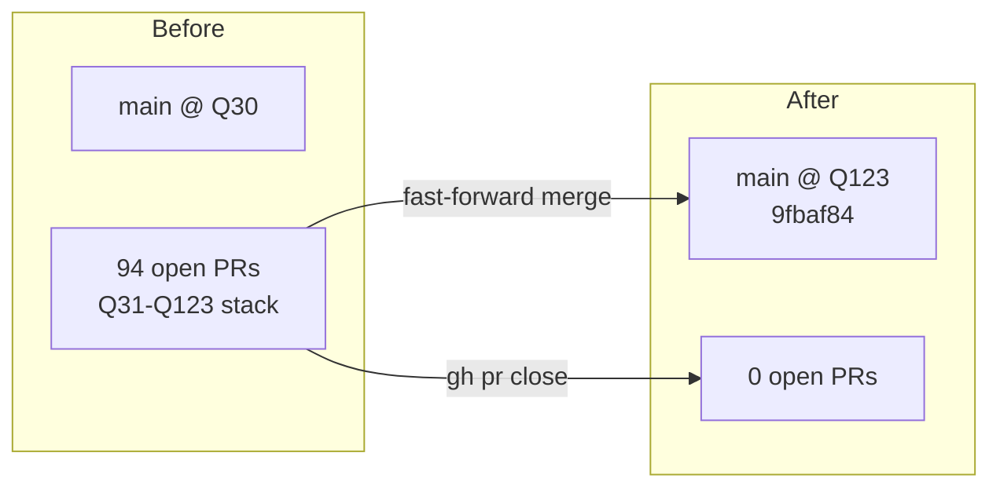
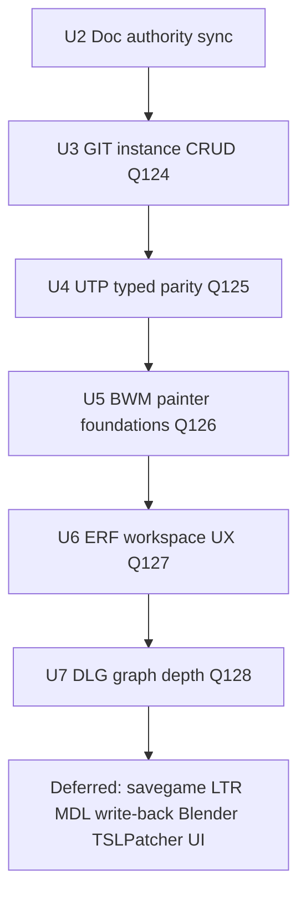

# PR Stack Consolidation and Holocron Parity Roadmap

## Summary

Consolidate the 94-PR `impl/q*` parity stack onto `main`, close superseded pull requests, and establish a bounded Q124+ roadmap toward remaining Holocron/PyKotor functional parity. Q31–Q123 are now on `main`; forward work prioritizes documentation authority sync, then module-designer GIT CRUD, spatial editing depth, and long-tail editor families.

---

## Problem Frame

The parity program shipped Q31–Q123 as a deep stacked PR queue (94 open PRs) while `main` lagged at Q30. Planning docs, `STRATEGY.md`, and the Holocron master plan diverged from branch reality, blocking reliable backlog selection. Modders cannot use shipped slices until they land on `main`; contributors cannot plan Q124+ against stale matrices.

**Landed (2026-06-10):** Fast-forward merge of `impl/q123-module-mdl-compare-report-export-c3f8` → `main` at `9fbaf84`; all 94 open PRs closed with consolidation comments.

**Remaining:** Post-merge verification, documentation authority refresh, and sequencing the next parity waves (~55–65% functional parity vs Holocron; largest gaps in GIT CRUD, BWM painter, DLG graph depth, ERF workspace, MDL write-back, savegame/LTR editors).

---

## Requirements

**Stack consolidation**

- R1. `main` contains the full Q31–Q123 parity stack (formats, module designer, indoor, compare, batch tooling).
- R2. No open PRs remain for slices already on `main`.
- R3. Post-merge headless editor test suite passes on `main` before declaring consolidation complete.

**Documentation authority**

- R4. `docs/50-execution/godot-capability-execution-queue.md` lists Q123 as shipped and names Q124 as active slice.
- R5. `STRATEGY.md`, `README.md`, and `docs/30-gap-analysis/godot-support-gaps.md` reflect Q1–Q123 shipped scope.
- R6. `docs/plans/2026-05-29-018-feat-holocron-full-parity-master-plan.md` editor inventory matches current Partial/Shipped statuses (no "Not started" for wav/lip/module designer/media batch families).

**Forward parity (Q124+)**

- R7. Q124 delivers GIT instance add/delete with Holocron-aligned insert-instance dialogs and undo/redo on the Module Designer mutation path.
- R8. Q125 lands UTP typed trap/script helper parity per existing plan (`docs/plans/2026-06-03-001-feat-utp-typed-parity-expansion-plan.md`).
- R9. Q126 begins BWM walkmesh interactive editing (triangle paint/select foundations), building on `BWMWriter` and Module Designer overlay.
- R10. Roadmap documents deferred waves (DLG graph, ERF workspace, MDL write-back, savegame, LTR) with explicit slice boundaries — not bundled into Q124–Q126.

---

## Key Technical Decisions

- **KTD1. Single fast-forward merge over sequential PR merges:** The stack had multiple roots on `main` and 76+ chained PRs; merging the Q123 tip into `main` in one fast-forward avoids rebase conflicts and closes the queue atomically. Future slices branch from `main` directly — no stacked `impl/q*` chains unless a short (≤3) dependent sequence is unavoidable.
- **KTD2. Documentation refresh is a gated slice (Q124a), not drive-by:** `openkotor-parity-matrix.md` already tracks through Q123 on the merged branch; `STRATEGY.md`, README, master plan, and support-gaps still lag. A dedicated doc slice prevents planning against split authority.
- **KTD3. Module designer wave before DLG graph:** GIT instance CRUD unblocks the highest-frequency area-editing loop Holocron users expect (add creature/placeable/door/trigger). DLG graph depth is larger UX surface area and stays Q128+.
- **KTD4. Reuse PTH CRUD patterns for GIT CRUD:** Q70–Q73 established toolbar-armed map placement, typed document mutation, dirty refresh, and `EditorUndoRedoManager` undo for PTH. GIT instance add/delete should mirror that architecture in `kotor_git_document.gd` and `module_designer_workspace_editor.gd`.
- **KTD5. Parity percentage is matrix-driven, not aspirational:** Backlog ordering follows `docs/30-gap-analysis/openkotor-parity-matrix.md` family status and `docs/50-execution/godot-capability-execution-queue.md` governance — not the stale phase table in the master plan.

---

## High-Level Technical Design

### Consolidation state (complete)

### Q124+ phased roadmap

### Holocron gap tiers (approximate, post-Q123)

| Tier | Families | Est. slices |
| --- | --- | --- |
| **Shipped / strong** | GFF core, 2DA, TLK, install GameFS, ERF write-back, SSF/TPC/WAV/LIP workspace, indoor native builders, compare/batch utilities | Q1–Q123 |
| **Partial — next waves** | GIT CRUD, BWM painter, DLG graph, NSS IDE depth, ERF browse UX, MDL mutation | ~15–25 slices |
| **Not started** | `ltr`, `savegame`, Blender bridge, TSLPatcher data editor UI, full MDL authoring | ~10–15 slices |

---

## Scope Boundaries

### In scope

- Post-merge verification on `main`
- Documentation authority sync
- Q124–Q128 roadmap units defined here
- Closing superseded PRs (completed)

### Deferred to follow-up work

- Backfilling individual `docs/plans/` for every Q31–Q123 slice (stack plans already merged; optional single retrospective doc)
- CI/GitHub Actions introduction (repo has no workflows today)
- Deleting remote `impl/q*` branches (hygiene pass after merge confirmation)
- Full MDL authoring / Blender bridge / TSLPatcher UI (separate program tracks)

### Outside this product's identity

- Porting Holocron's Qt UI verbatim
- Line-for-line PyKotor Python API compatibility inside Godot

---

## System-Wide Impact

- **Contributors:** Branch from `main` only; one slice = one PR to `main`; update execution queue + parity matrix per slice.
- **Modders:** Q31–Q123 capabilities (module designer PTH editing, media batch/compare, indoor native export, DXT tooling) become available on `main` after plugin refresh.
- **Planning:** Master plan and STRATEGY become trustworthy again after U2; Q-number governance fixes duplicate Q80–Q86 labels in closed PR titles only (no renumbering shipped code).

---

## Risks and Dependencies

| Risk | Mitigation |
| --- | --- |
| Undetected merge regressions across 122 commits | Run full `tests/editor/test_*.gd` suite on `main` (U1); spot-check Module Designer, TPC, and compare paths |
| Stale docs mis-route Q124 implementers | U2 blocks feature slices until authority docs synced |
| GIT CRUD touches undo/dirty/install preflight | Follow Q20/Q70 patterns; characterization tests before behavior changes |
| Scope creep into full DLG graph editor | Q128 is planning placeholder only; Q124–Q126 stay bounded |

---

## Implementation Units

### U1. Post-merge verification gate

**Goal:** Confirm `main` at `9fbaf84` is healthy after stack consolidation.

**Requirements:** R1, R3

**Dependencies:** None (merge landed)

**Files:**

- `tests/editor/test_*.gd` (run all)
- `docs/plans/2026-06-10-056-feat-pr-stack-merge-holocron-parity-roadmap-plan.md` (this plan)

**Approach:** Run full headless editor test suite on `main`. Smoke-tested `test_mdl_workspace_editor.gd` (Q122/Q123 toolbar paths) — extend to full suite. Record pass/fail count; file issues for any failures before starting Q124 code.

**Test scenarios:**

- Happy path: all `tests/editor/test_*.gd` exit 0 on `main`
- Integration: `test_module_designer_walkmesh_install.gd` and `test_compare_report_export.gd` pass (representative module + compare stack)
- Error path: any failure blocks Q124 feature work until fixed or scoped out with documented waiver

**Verification:** Full headless suite green on `main`; consolidation declared complete in execution queue active slice note.

---

### U2. Documentation authority sync

**Goal:** Align strategy, README, master plan, and support-gaps with Q1–Q123 shipped reality; activate Q124 in execution queue.

**Requirements:** R4, R5, R6

**Dependencies:** U1

**Files:**

- `STRATEGY.md`
- `README.md`
- `docs/30-gap-analysis/godot-support-gaps.md`
- `docs/plans/2026-05-29-018-feat-holocron-full-parity-master-plan.md`
- `docs/50-execution/godot-capability-execution-queue.md`
- `plugin.cfg` (description line, if user-facing)

**Approach:** Update Phase 2 track status to Q1–Q123 shipped summary. Rewrite master plan editor table rows for wav/lip/ssf/mdl/bwm/module designer/indoor from Not started → Partial/Shipped with Q-slice references. Set execution queue active slice to Q124 GIT CRUD. Trim README feature table to include SSF/TPC/WAV/LIP/Module Designer/Indoor Builder/compare tooling.

**Test expectation:** none — documentation-only slice.

**Verification:** No doc still claims wav/lip/module designer are "Not started"; execution queue active row names Q124; STRATEGY `last_updated` bumped.

---

### U3. GIT instance CRUD (Q124)

**Goal:** Add and delete GIT instances (creature, placeable, door, trigger, waypoint, sound, encounter) from Module Designer with insert dialogs and undo/redo.

**Requirements:** R7

**Dependencies:** U2

**Files:**

- `resources/documents/kotor_git_document.gd`
- `ui/workspace/editors/module_designer_workspace_editor.gd`
- `ui/workspace/editors/module_designer_map_view.gd` (or equivalent map interaction surface)
- `tests/editor/test_module_designer_git_instance_crud.gd` (new)

**Approach:** Extend `KotorGitDocument` with `add_instance(type, template_resref, position, bearing)` and `remove_instance(instance_id)` using typed structs and default field templates per Holocron GIT families. Toolbar **Add Instance…** opens type/template picker; map click places instance (mirror Q70 arm mode). **Delete Instance** on selection with undo. Refresh map/tree/3D on mutation; preserve install preflight on save.

**Execution note:** Add characterization coverage for existing GIT move/rotate before extending CRUD APIs.

**Patterns to follow:** Q20 drag-move, Q21 bearing rotate, Q70 PTH point add, Q71 PTH point remove.

**Test scenarios:**

- Happy path: add creature instance at map click; appears in tree and 3D; undo removes it
- Happy path: delete selected placeable; undo restores instance
- Edge case: add with missing template resref shows validation error; no partial instance written
- Error path: remove last selected instance when none selected — no-op with user feedback
- Integration: save/install preflight still passes after add+delete cycle on test fixture GIT

**Verification:** Headless CRUD tests pass; manual Module Designer smoke on one test module; parity matrix notes GIT CRUD partial → improved.

---

### U4. UTP typed parity expansion (Q125)

**Goal:** Ship trap scalar and script hook typed helpers on UTP per existing requirements plan.

**Requirements:** R8

**Dependencies:** U2

**Files:**

- `resources/documents/kotor_utp_document.gd`
- `resources/typed/utp_resource.gd`
- `tests/editor/test_gff_resource_factory.gd` (or dedicated UTP test)
- `docs/plans/2026-06-03-001-feat-utp-typed-parity-expansion-plan.md` (execute, do not duplicate)

**Approach:** Implement per linked plan U1–U3; mark that plan `status: shipped` when done.

**Patterns to follow:** Q14 blueprint field-depth patterns; existing UTP summary field mapping.

**Test scenarios:** Per origin plan R6–R7 (factory assertions, deterministic helper behavior for present/missing/default states).

**Verification:** Origin plan verification section satisfied; parity matrix UTP row updated.

---

### U5. BWM walkmesh painter foundations (Q126)

**Goal:** Begin interactive walkmesh editing in Module Designer — select walkable/unwalkable triangles and persist via `BWMWriter`.

**Requirements:** R9

**Dependencies:** U3 (optional sequencing — can parallel if U1 green)

**Files:**

- `formats/bwm_writer.gd`
- `ui/workspace/editors/module_designer_workspace_editor.gd`
- `ui/workspace/panels/module_designer_viewport_3d.gd` (or walkmesh overlay surface)
- `tests/editor/test_module_designer_bwm_paint.gd` (new)

**Approach:** Read-only overlay (Q17) already renders walkmesh. Add **Paint Walkmesh** mode: click triangle toggles walkable flag in typed BWM document; undo per toggle; export/install uses existing Q56 path. Defer full Holocron painter UX (brush sizes, edge tools) to follow-up.

**Test scenarios:**

- Happy path: toggle one triangle walkable state; `BWMWriter` round-trip preserves change
- Edge case: paint on area with no loaded walkmesh — mode disabled
- Integration: compare-with-override (Q122) still works after local paint edits

**Verification:** Headless paint test passes; walkmesh install preflight unchanged for unpainted areas.

---

### U6. ERF archive workspace UX (Q127)

**Goal:** Dedicated ERF/MOD/RIM browse-and-extract workspace beyond write-back — list members, open nested resources, extract to override.

**Requirements:** R10 (roadmap placement)

**Dependencies:** U2

**Files:**

- `ui/workspace/editors/erf_workspace_editor.gd` (new or extend existing archive path)
- `resources/documents/kotor_erf_document.gd`
- `editor/workspace/kotor_workspace_controller.gd`
- `tests/editor/test_erf_workspace_editor.gd` (new)

**Approach:** Holocron `erf.py` analog: member table, double-click open routed resource, extract selected to GameFS override with preflight. Reuse Q4 write-back and GameFS index.

**Test scenarios:**

- Happy path: open MOD, list members, extract one GFF to override path
- Happy path: open nested resource in workspace tab
- Error path: extract with invalid resref — preflight blocks with message

**Verification:** Headless ERF workspace tests pass; parity matrix archive row moves toward Partial+.

---

### U7. DLG graph editor depth (Q128)

**Goal:** Plan and stub next DLG wave — graph layout, node creation/deletion, bulk link operations beyond Q33 jump-to-target.

**Requirements:** R10

**Dependencies:** U2, U4

**Files:**

- `ui/workspace/editors/dlg_workspace_editor.gd`
- `resources/documents/kotor_dlg_document.gd`
- `tests/editor/test_dlg_workspace_editor.gd`
- `docs/plans/` (new Q128 plan artifact when scoped)

**Approach:** This unit is **planning-heavy**: audit Holocron `editors/dlg/` for minimum viable graph operations; produce child `ce-plan` for Q128 before implementation. Do not implement graph canvas in this roadmap pass.

**Test scenarios:** Deferred to Q128 child plan.

**Verification:** Q128 plan written; execution queue updated with Q128 entry; no code churn in U7 beyond audit notes.

---

## Phased Delivery

| Phase | Units | Outcome |
| --- | --- | --- |
| **Phase A — Consolidation** | U1 (complete), PR close (complete) | `main` @ Q123, 0 open PRs |
| **Phase B — Authority** | U2 | Trustworthy docs for planning |
| **Phase C — Module wave** | U3, U5 | Area editing approaches Holocron module designer |
| **Phase D — Blueprint/media** | U4, U6 | UTP depth + archive UX |
| **Phase E — Dialogue** | U7 → child plan | DLG graph scoped for implementation |

---

## Success Metrics

- Open PR count = 0 (achieved)
- `main` commit includes Q123 compare report export (achieved: `9fbaf84`)
- Full headless test suite green on `main` (U1)
- Execution queue active slice = Q127 after U2–U5 (Q124–Q126 shipped on PR #119)
- Parity matrix module designer GIT row upgrades after U3; BWM paint noted after U5

---

## Sources and Research

- Repo: 94 PR stack topology, merge to `main`, test conventions (`.github/copilot-instructions.md`)
- `docs/30-gap-analysis/openkotor-parity-matrix.md` — authoritative through Q123 on `main`; Q124–Q126 entries track PR #119 until merge
- `docs/50-execution/godot-capability-execution-queue.md` — queue governance
- `docs/plans/2026-05-29-018-feat-holocron-full-parity-master-plan.md` — north-star inventory (stale; U2 target)
- Prior gap audit (~55–65% functional parity; ~78–117 slices remaining at current granularity)
- External research: skipped — local patterns sufficient for roadmap sequencing

---

## Open Questions

- **Branch hygiene:** Delete remote `impl/q*` and `feat/q*` branches after merge? (Default: yes, non-blocking cleanup pass.)
- **CI:** Introduce GitHub Actions for headless tests on `main`? (Deferred — recommend separate plan.)
- **Q124 insert dialogs:** Match Holocron template picker exactly vs minimal resref+type form? (Resolve during Q124 `ce-plan` deepening.)
